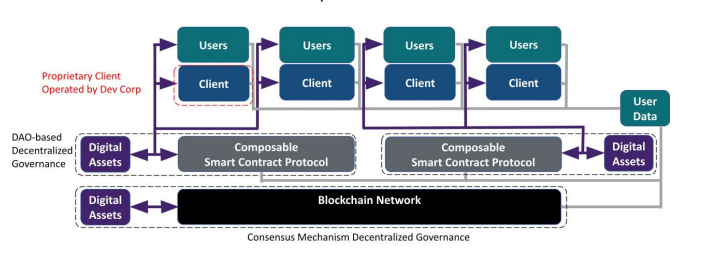

### Decentralization
Decentralization, in the context of Web3, refers to the distribution of control, authority, and decision-making across a network of nodes or participants rather than relying on a central authority or intermediary. It is a fundamental principle of Web3 that aims to address the limitations and vulnerabilities of centralized systems.

In traditional centralized systems, such as social media platforms or financial institutions, a central authority controls and manages the flow of information, transactions, and user interactions. This centralization of power can lead to issues like data breaches, censorship, lack of transparency, and dependence on a single entity for critical functions.

Web3, on the other hand, seeks to decentralize these systems using various technologies, such as blockchain and peer-to-peer networks. 

------------------------------------------------

#### Decentralization Architecture
<ul>

<b> The various components and layers of a typical Web3 decentralization architecture:</b>

1. **Application Layer**
    - Decentralized Applications (dApps): These are user-facing applications built on top of the Web3 infrastructure. They interact with smart contracts and decentralized protocols to provide various functionalities to users.

2. **Smart Contract Layer**
    - Smart Contracts: These are self-executing contracts deployed on a blockchain. They contain the rules and logic that govern the behavior of dApps, allowing for automated and trustless execution of agreements.

3. **Blockchain Layer**
    - Consensus Mechanism: This layer involves the consensus algorithm that ensures agreement on the state of the blockchain among participating nodes. Examples include Proof of Work (PoW), Proof of Stake (PoS), and other consensus algorithms.
    - Blockchain Network: It consists of a network of nodes that maintain a distributed copy of the blockchain. These nodes validate transactions, secure the network, and participate in the consensus process.

4. **Peer-to-Peer (P2P) Layer**
    - Peer-to-Peer Network: It facilitates direct communication and data exchange between nodes. Participants can connect and interact with each other without relying on intermediaries or central servers.

5. **Storage and Interoperability Layer**
    - Distributed File Storage: This layer involves decentralized storage systems that allow data to be stored across multiple nodes in a secure and redundant manner. Examples include IPFS (InterPlanetary File System) and Swarm.
    - Interoperability Protocols: These protocols enable communication and data exchange between different blockchain networks, allowing for cross-chain transactions and interoperability of dApps.

6. **Identity and Governance Layer**
    - Decentralized Identity (DID): It provides individuals with control over their digital identities and allows for secure and verifiable authentication and authorization in Web3 applications.
    - Governance Frameworks: These frameworks enable decentralized decision-making and community governance within a network. They often involve voting mechanisms, stakeholder participation, or DAOs (Decentralized Autonomous Organizations).

    
Remember it is a high-level overview of a Web3 decentralization architecture, and the actual implementation may vary depending on the specific blockchain platform or technology stack being used.

</ul>

------------------------------------------------

#### The Difference between Web 2.0 and web 3.0 decentralization.
<ul>

</ul>
<b> 

**The shift from a web2 centralized model to a web3 decentralized model involves:** 
</b>

- deploying an open-source smart contract protocol to a decentralized and programmableblockchain network to form the core infrastructure layer of the web3 system – the smart
contract protocol provides an execution layer for all of the components of the backend that can be deployed on-chain (i.e., payments, messaging, etc.);

- operating a “client” layer in a decentralized manner – the client represents all of the system’s software that operates off-chain and acts as a gateway to the smart contract protocol (clients can range from being simple frontend websites to complex applications);

- adding digital asset distributions and incentivization mechanisms from the smart contract protocol -- this could be an airdrop to contributors and consumers; issuances to insiders
(employees, advisors, and stockholders of the developer company); the allocation ofdigital assets to an explicit incentivization scheme (such as liquidity mining in DeFi); and
the formation of a treasury controlled by the DAO and to be used in connection with any future incentivization.

- launching DAO governance of the smart contract protocol and DAO treasury.

- ensuring user data is owned and retained by the user (currently a significant contention in
web2 systems).

##### Resources:
  
- Principles & Models of Web3 Decentralization [`Here📄`](https://a16z.com/wp-content/uploads/2022/04/principles-and-models-of-decentralization_miles-jennings_a16zcrypto.pdf)

